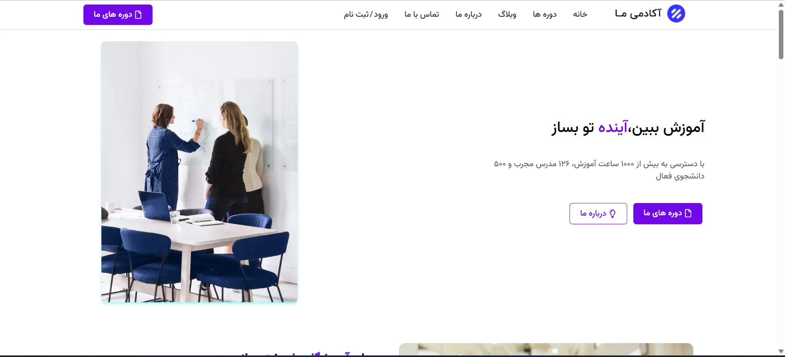
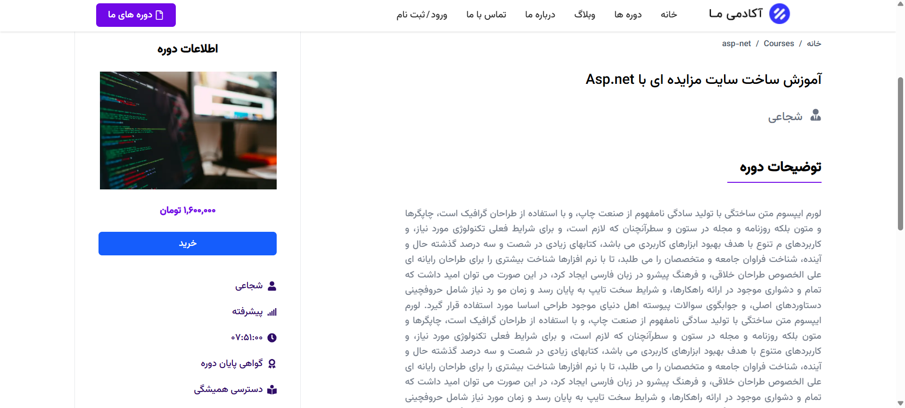
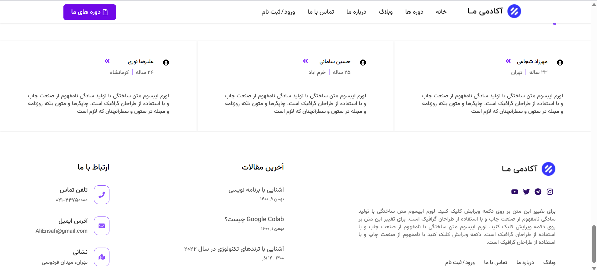
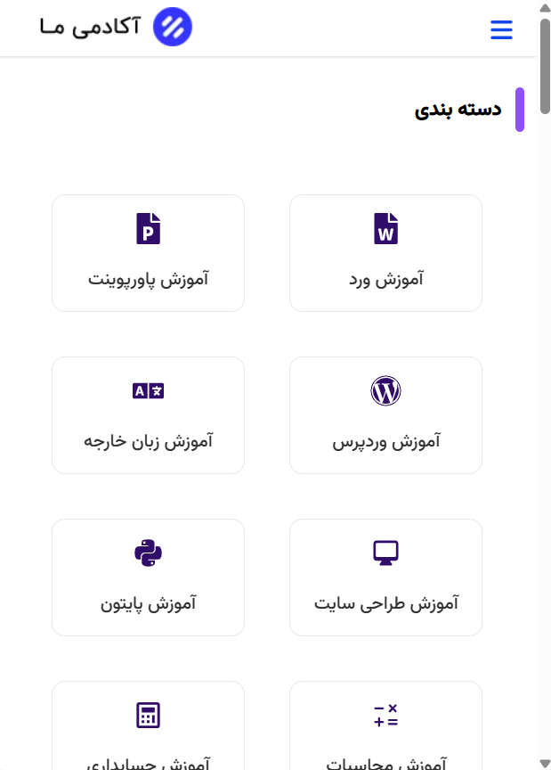

# Learning Project

A modern online course sales platform built with Next.js, React, TypeScript, and Tailwind CSS.

Demo: https://learning-course-project.vercel.app/

## Overview

Learning Project is a frontend web application designed for browsing and purchasing educational courses. The project demonstrates modern React development practices, form handling, validation, responsive design, and reusable component architecture.

The app includes user authentication pages (registration and login), courses, blog, about us, contact us, and a clean user experience built with modern frontend technologies.

## Features

* User Registration Form
* User Login Form
* Client-side Form Validation
* Responsive Design
* Reusable UI Components
* Toast Notifications
* Type-safe Development
* Modern Project Structure

## Tech Stack

* Next.js
* React
* TypeScript
* Tailwind CSS
* Formik
* Yup
* React Toastify
* React Icon
* Embla Carousel

## Technical Highlights

### Form Management

Forms are implemented using Formik to provide a scalable and maintainable approach to handling user input and form state.

### Validation

Yup is used for schema-based validation to ensure data consistency and improve user experience.

### Type Safety

TypeScript is used throughout the project to reduce runtime errors and improve code maintainability.

### Styling

Tailwind CSS is used to build responsive and consistent user interfaces with a utility-first approach.

### User Feedback

Toast notifications are implemented to provide immediate feedback for user actions and validation results.

## Installation

Clone the repository:

```bash
git clone https://github.com/AliEnsafi/learning-course-project
```

Install dependencies:

```bash
npm install
```

Run development server:

```bash
npm run dev
```

Open:

```text
http://localhost:3000
```

## Production Build

```bash
npm run build
npm start
```

## Screenshots

* Home Page



* course Page



* footer Page



* responsive Page



## Author

Ali Ensafi
Frontend Developer
